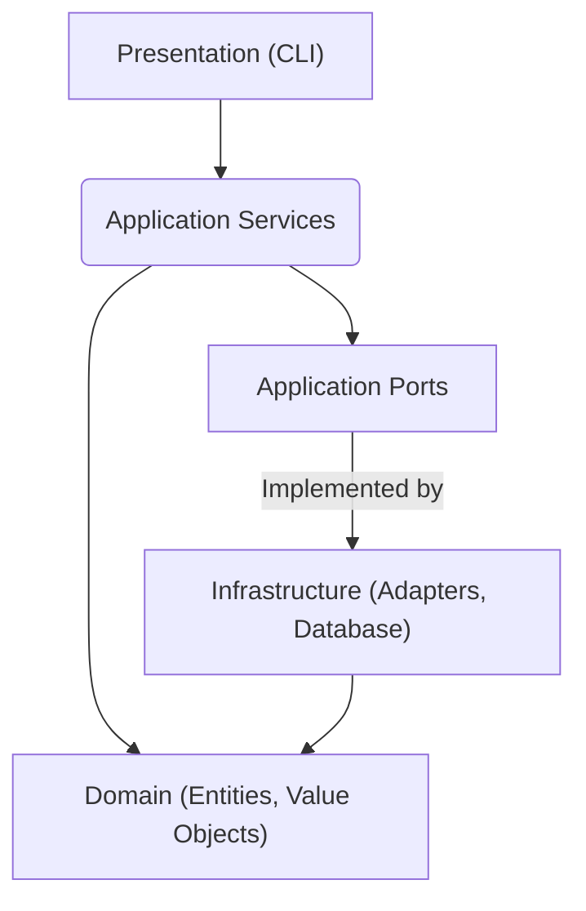

# System Architecture Overview

This diagram illustrates the high-level architecture of the Speechdown application.

```mermaid
graph TD
    A["Presentation (CLI)"] --> B(Application Services)
    B --> C[Application Ports]
    B --> D["Domain (Entities, Value Objects)"]
    C -- Implemented by --> E["Infrastructure (Adapters, Database)"]
    E --> D
```