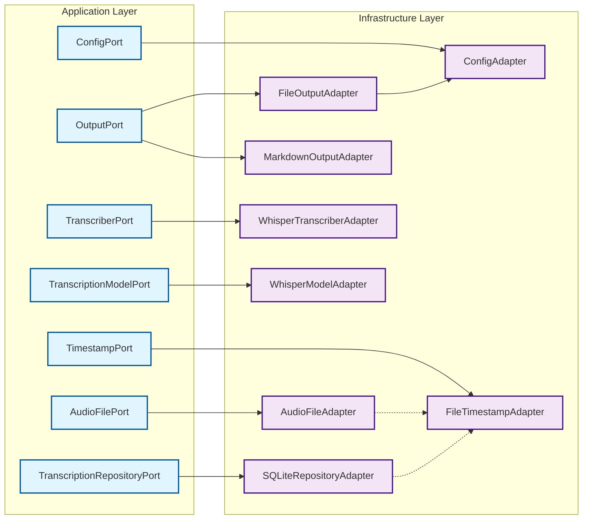

# Application Ports and Adapters

This diagram details the interfaces (Ports) defined within the Application Layer and their corresponding implementations (Adapters) in the Infrastructure Layer. It illustrates how the application's core logic interacts with external concerns like file systems, configuration, transcription services, and data storage through these defined contracts.

## Port Descriptions

### Application Layer Ports

- **AudioFilePort**: Interface for collecting and processing audio files from the file system
- **ConfigPort**: Interface for application configuration management (languages, output directories, model settings)
- **OutputPort**: Interface for outputting transcription results in various formats  
- **TranscriberPort**: Interface for audio transcription operations
- **TranscriptionModelPort**: Interface for loading and managing transcription models
- **TranscriptionRepositoryPort**: Interface for persisting and retrieving transcription data
- **TimestampPort**: Interface for extracting timestamps from filenames or file metadata

### Infrastructure Layer Adapters

- **AudioFileAdapter**: Collects audio files from directories and creates domain entities
- **ConfigAdapter**: Manages configuration through JSON files with validation and defaults
- **FileOutputAdapter**: Outputs transcription results to markdown files
- **MarkdownOutputAdapter**: Alternative output adapter for markdown format to stdout
- **WhisperTranscriberAdapter**: Implements transcription using OpenAI Whisper
- **WhisperModelAdapter**: Manages Whisper model loading and lifecycle
- **SQLiteRepositoryAdapter**: Persists transcription data using SQLite database
- **FileTimestampAdapter**: Extracts timestamps from filenames using pattern matching

## Dependency Relationships

The diagram shows several types of relationships:

1. **Port Implementation** (solid arrows): Each adapter implements its corresponding port interface
2. **Adapter Dependencies** (dotted arrows): Some adapters depend on other adapters:
   - `AudioFileAdapter` depends on `FileTimestampAdapter` for timestamp extraction
   - `SQLiteRepositoryAdapter` depends on `FileTimestampAdapter` for file timestamp operations
   - `FileOutputAdapter` depends on `ConfigAdapter` for output configuration

## Key Architectural Benefits

- **Testability**: Each port can be easily mocked for unit testing
- **Flexibility**: Multiple implementations of the same port (e.g., different output formats)
- **Separation of Concerns**: Business logic (application layer) is isolated from technical details (infrastructure layer)
- **Dependency Inversion**: Application layer depends only on abstractions, not concrete implementations