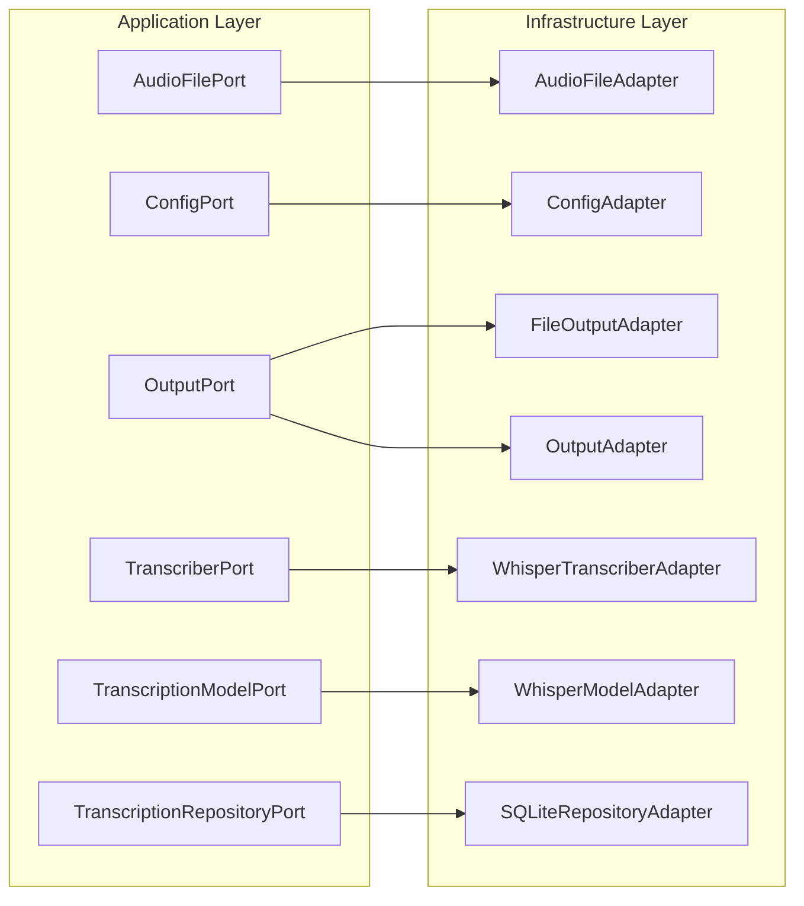

# Application Ports and Adapters

This diagram details the interfaces (Ports) defined within the Application Layer and their corresponding implementations (Adapters) in the Infrastructure Layer. It illustrates how the application's core logic interacts with external concerns like file systems, configuration, transcription services, and data storage through these defined contracts.

